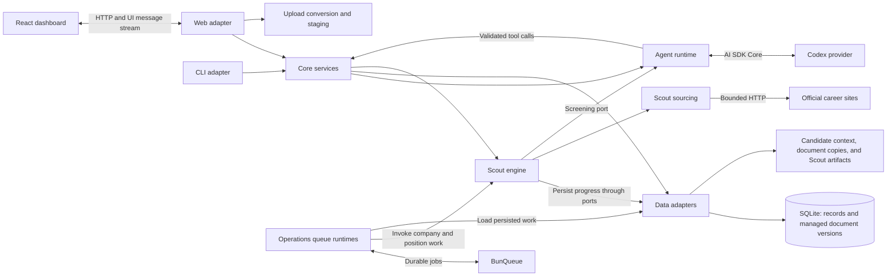

# Architecture Overview

GigFinder runs a Bun server that serves the browser, handles assistant requests, and runs Scout work in the background. A separate command-line program can read and change the same stored records.

## System Diagram

The diagram below is verified against the implementation, including queue ownership and file labels. Arrows show runtime calls and data flow, not package imports.

[Web composition](https://github.com/paulmccallick/gig-finder/blob/3dca919a98d25a33cf7f0bf0c6738a1c03944584/src/web/app.ts) constructs the services and starts both queue runtimes. [Operations](https://github.com/paulmccallick/gig-finder/blob/3dca919a98d25a33cf7f0bf0c6738a1c03944584/src/operations/scout-runtime.ts) owns BunQueue; the core owns search and processing rules. [Document persistence](documents-profile.md) distinguishes saved database content from derived files.

## Components

| Component | Responsibility | Implementation |
|---|---|---|
| React browser | Displays opportunity, contact, task, Scout, document, and assistant views; sends requests to the server. | [Browser application](https://github.com/paulmccallick/gig-finder/blob/3dca919a98d25a33cf7f0bf0c6738a1c03944584/src/web/client/App.tsx) |
| Bun web application | Constructs services, routes HTTP requests, starts Scout workers, and shuts down resources. | [Server](https://github.com/paulmccallick/gig-finder/blob/3dca919a98d25a33cf7f0bf0c6738a1c03944584/src/web/server.ts), [composition](https://github.com/paulmccallick/gig-finder/blob/3dca919a98d25a33cf7f0bf0c6738a1c03944584/src/web/app.ts), [routing](https://github.com/paulmccallick/gig-finder/blob/3dca919a98d25a33cf7f0bf0c6738a1c03944584/src/web/request-handler.ts) |
| Shared core services | Validate and apply changes to Gigs, people, relationships, tasks, interactions, documents, and settings. | [Application services](https://github.com/paulmccallick/gig-finder/blob/3dca919a98d25a33cf7f0bf0c6738a1c03944584/src/core/application.ts) |
| Conversation runtime | Builds model context, exposes tools, streams responses, and saves completed turns. | [Conversation implementation](conversational-agent.md) |
| Scout workers | Search companies, retrieve descriptions, evaluate postings, and coordinate review/promotion work. | [Scout implementation](gig-scout.md) |
| Data adapters | Read and write SQLite records and associated files through interfaces defined by the core. | [Local service construction](https://github.com/paulmccallick/gig-finder/blob/3dca919a98d25a33cf7f0bf0c6738a1c03944584/src/data/local-application.ts), [persistence](persistence.md) |
| CLI | Parses commands and calls shared services without going through HTTP. | [CLI startup](https://github.com/paulmccallick/gig-finder/blob/3dca919a98d25a33cf7f0bf0c6738a1c03944584/src/cli/app.ts) |

## Request and Background Processing

A browser request reaches the web router. Depending on its route, the router returns records, starts a conversation, reads a document, changes settings, or starts Scout work. The assistant invokes domain tools directly through shared services; it does not automate the browser.

Scout has two independent work queues: one for searching companies and one for processing the resulting positions. Both run within the server process, with queue state stored in separate SQLite files. A company search can finish while description retrieval and evaluation continue.

The structured candidate profile loads at startup. Each conversation model request reads the saved model preference; Scout screening is configured separately at startup. See the [conversation](conversational-agent.md) and [Scout](gig-scout.md) implementation documents for their exact settings and work lifecycles.

## Code Boundaries

Core services define business rules and interfaces for storage. Data adapters implement storage; browser, CLI, and agent adapters provide ways to call the services. The [dependency rules](https://github.com/paulmccallick/gig-finder/blob/3dca919a98d25a33cf7f0bf0c6738a1c03944584/.dependency-cruiser.cjs) check these directions and restrict where adapters can be constructed.

The routes and commands expose different subsets of the services. For example, a board may read records while an agent tool can edit them. The [interface guide](../interfaces/README.md) links to each supported contract.

## Saving and Failure Behavior

A domain operation can save several records together in a transaction: either all those writes succeed or none do. A complete assistant response is not one such transaction. If a tool saves a task and the response later fails, that task can remain saved. See [persistence](persistence.md) and [reliability](../requirements/reliability.md).

`/healthz` checks database validity and reports the running source revision. Separate checks are needed to know whether model calls and company searches work. See [observability](../operations/observability.md), [deployment](../operations/deployment.md), and [recovery](../operations/recovery.md).

## Capability Implementations

- [Opportunities](opportunities.md): Gig edits, posting matching, and board reads.
- [Networking](networking.md): contacts, interactions, contact history, and optional roles in Gigs.
- [Tasks](tasks.md): task dates, related records, and completion.
- [Documents and profile](documents-profile.md): document versions, ownership, uploads, and candidate information.
- [Conversational agent](conversational-agent.md): model context, streams, tools, and conversation saving.
- [Gig Scout](gig-scout.md): source retrieval, queues, evaluations, and promotion.

## Shared Requirements and Decisions

[Shared quality constraints](../requirements/global-nfrs.md) distinguish current guarantees from unspecified service targets. [Security and privacy](../requirements/security.md) describes the access boundary. [Architectural decisions](../decisions/README.md) links to recorded reasons for the storage and deployment choices.

## Related ADRs

- [ADR 0002: Isolate AI SDK UI in the web package](../decisions/0002-isolate-ai-sdk-ui.md)
- [ADR 0004: Share one domain input contract across create and update](../decisions/0004-share-domain-input-contracts.md)
- [ADR 0007: Deploy Docker images with external state and verified rollback](../decisions/0007-immutable-production-deployment.md)
- [ADR 0009: Keep personal data out of source control](../decisions/0009-keep-personal-data-out-of-source-control.md)
- [ADR 0010: Use BunQueue for durable background work](../decisions/0010-use-bunqueue-for-background-work.md)
- [ADR 0013: Allow private application data in local logs](../decisions/0013-allow-private-data-in-local-logs.md)
- [ADR 0014: Separate Scout discovery from position processing](../decisions/0014-separate-scout-discovery-from-position-processing.md)
- [ADR 0015: Keep business logic out of operations](../decisions/0015-keep-business-logic-out-of-operations.md)
- [ADR 0016: Mutate domain-owned tables through the owning domain service](../decisions/0016-own-domain-table-mutations.md)

## Related documents

- [Persistence](persistence.md)
- [Interface Guide](../interfaces/README.md)
- [Shared Quality Constraints](../requirements/global-nfrs.md)
- [Architectural Decisions](../decisions/README.md)
